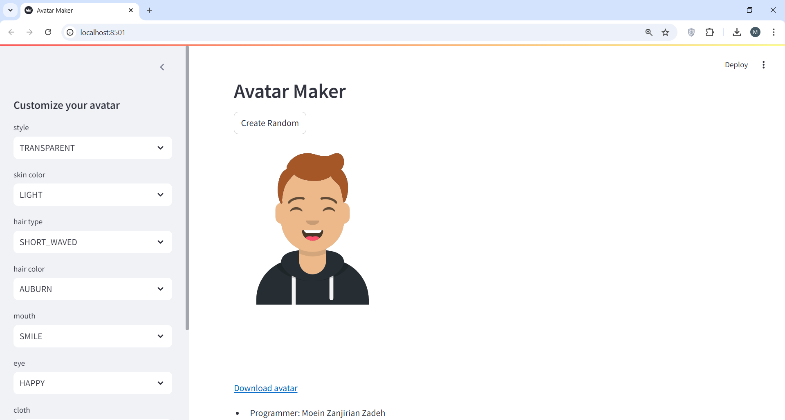
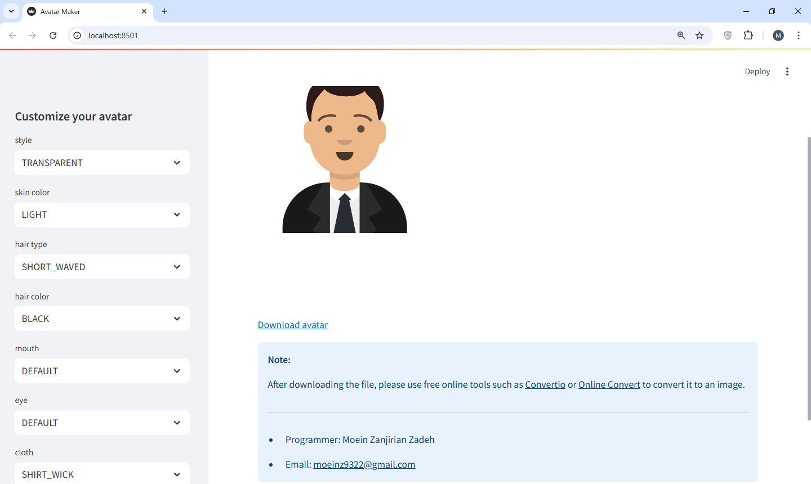

# Avatar Maker

**Avatar Maker** is a web application built with Streamlit that allows users to customize their own avatars and download them in SVG format.




## Features

- Customize various aspects of the avatar such as style, skin color, hair type, hair color, mouth type, eye type, cloth type, and cloth color.
- Generate a random avatar with the "Create Random" button.
- View the avatar in SVG format within the web app.
- Download the avatar as an SVG file.
- Convert the SVG file to a PNG image using free online tools.

## Installation

To run the Avatar Maker application, you'll need to have Python installed on your system. Follow the steps below to set up the application:

1. **Clone the repository:**

   ```
   git clone https://github.com/Moeinz9322/Avatar_Maker_Streamlit.git
   cd avatar-maker
   ```
2. **Install the required packages:**
    ```
    pip install -r requirements.txt
    ```
3. **Install the required packages:**
    ```
    pip install -r requirements.txt
    ```
    
# Usage

To run the application, execute the following command in the terminal:

```
streamlit run avatar_streamlit.py
```
This will start the Streamlit server and open the application in your default web browser.

## Downloading and Converting Avatar

- Customize your avatar using the options in the sidebar.
- Click the "Download avatar" link to download the SVG file.
- Use free online tools such as Convertio or Online Convert to convert the SVG file to a PNG image.
